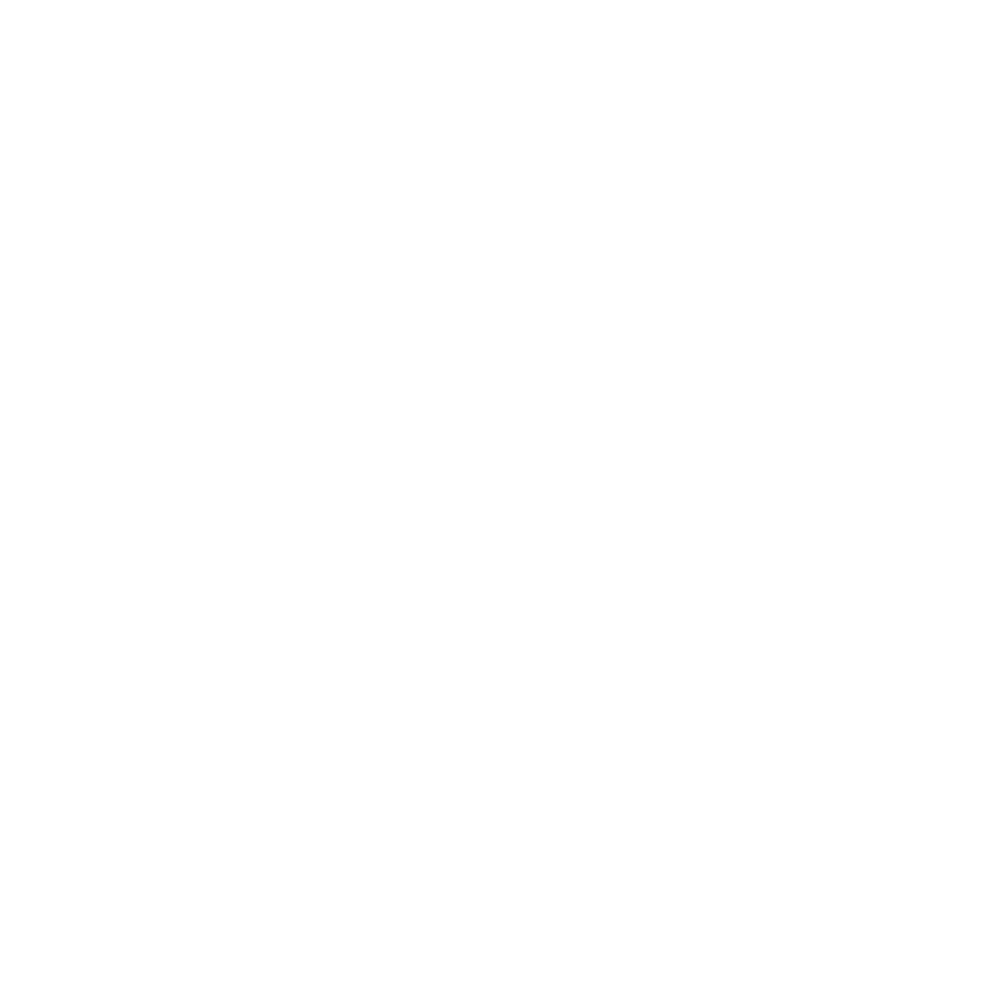

<h1>SomeONE Studio</h1>

A indie game development group

<h2>What are we doing?</h2>

- 🎮 We are developing games on multi-platform.
- 🔨 We are working on some unofficial-creations of famous games, such as Minecraft, Terraria.

<h2>Our Staff Number in Total are <strong>5</strong></h2>

> 
> <h1>somerui</h1>
> 
Team Co-founder

> 
Main Director, Full-stack Engineer

---

> 
> <h1>LKXN a.k.a. someqi</h1>
> 
Team Co-founder

> 
Main Director

---

> 
> <h1>FAKE_ANZEL</h1>
> 
Team Member

> 
Music Directo

---

> 
> <h1>Vane</h1>
> 
Team Member

> 
Back-end Engineer

---

> 
> <h1>*p</h1>
> 
Team Member

> 
Graphic Designer

---

    

