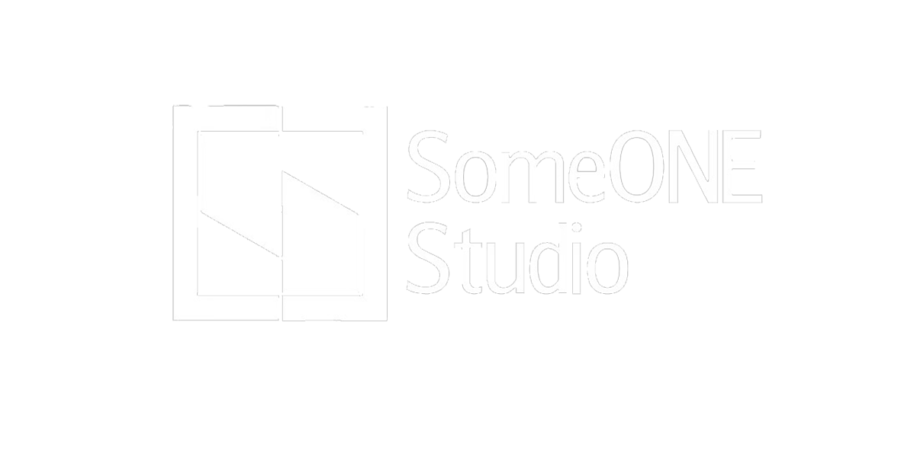

<h2>We are SomeONE Studio,a indie-game development team.

What are we doing?
===============

- We are developing games for PC, consoles, and mobile platforms.
- We are also working on some doujin-creations of famous games, such as Minecraft, Terraria, and more.
- Also, we are working on some open-source projects, such as our own game engine, game framework, and a big project called "Zero-Point Engine".

How many members we have?
===

<h2> We have 3 members in total.</h2>

>  
>
> <h1>somerui</h1>
>
> 
Team Co-founder

> 
Game director Programmer 

---

>  
> <h1>someqi</h1>
> 
Team Co-founder

> 
Game director Art Director Programmer 

---

>  
> <h1>FAKE_ANZEL</h1>
> 
Music Director 

---

>  
> <h1>Nersia/ネルシア</h1>
> 
Informal member

> 
 Art Director Programmer 

