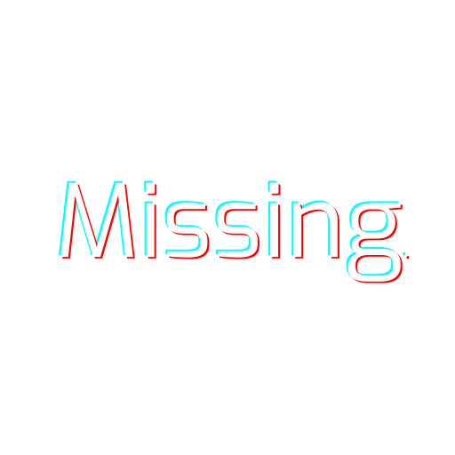

<svg xmlns="http://www.w3.org/2000/svg" viewBox="0 0 1024 1024.67" alt="image" width="300" height="auto"><defs></defs><g id="图层_5" data-name="图层 5"><polyline class="cls-1" points="0 528.33 64 528.33 64 960 960 960 960 528.33 1024 528.33 1024 1024 64 1024.67 0 1024.67"/></g><g id="图层_4" data-name="图层 4"><polyline class="cls-1" points="0 496.33 64 496.33 64 64.67 960 64.67 960 496.33 1024 496.33 1024 0.67 64 0 0 0"/></g><g id="图层_3" data-name="图层 3"><polyline class="cls-1" points="514.67 928.72 96 928.72 96 528.33 750.18 528.68 514.67 928.72"/></g><g id="图层_2" data-name="图层 2"><polyline class="cls-1" points="508.97 96.83 927.64 96.83 927.64 497.22 273.46 496.88 508.97 96.83"/></g></svg>
-
<h1>SomeONE Studio 
A indie game development team
</h1>

<h2>What are we doing?</h2>

- 🎮 We are developing games on multi-platform.
- 🔨 We are working on some unofficial-creations of famous games, such as Minecraft, Terraria.

<h2>Our Staff Number in Total are <strong>5</strong>:</h2>

> 
> <h1><a href="https://github.com/somerui">somerui</a> 
Team Co-founder
</h1>
> 
Main Director, Music Production, Full-stack Engineer

---

> 
> <h1>Keysama 
Team Co-founder

a.k.a. someqi
 </h1>
> 
Main Director, Publicity Group, Back-end Engineer

---

> 
> <h1>FAKE_ANZEL 
Team Member
</h1>
> 
> 
Music Production

---

> 
> 
> <h1>Vane 
Team Member
</h1>
> 
Back-end Engineer

---

